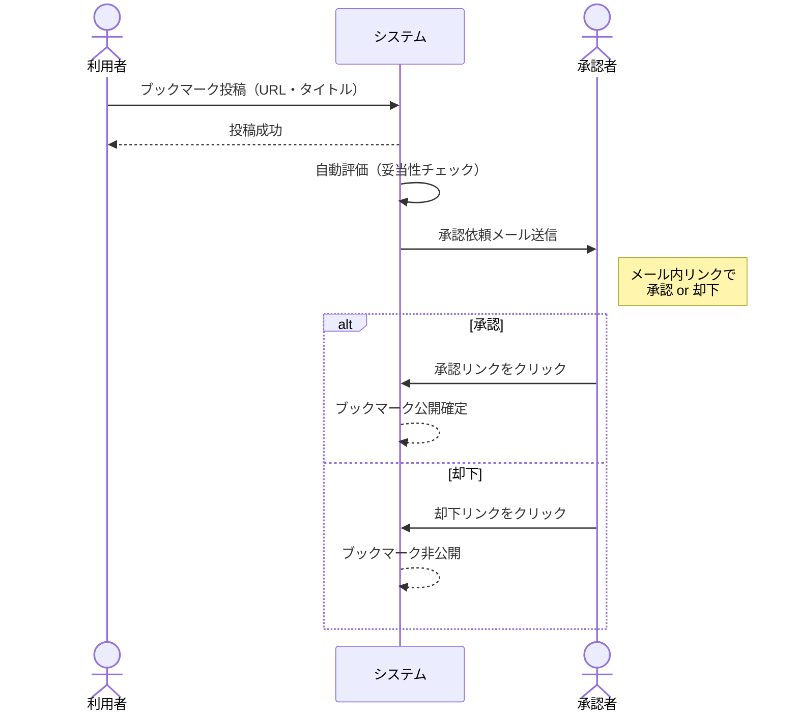

# Bookmark 承認ワークフロー シーケンス図

```mermaid
sequenceDiagram
    actor 利用者
    participant システム
    actor 承認者

    利用者->>システム: ブックマーク投稿（URL・タイトル）
    システム-->>利用者: 投稿成功

    システム->>システム: 自動評価（妥当性チェック）
    システム->>承認者: 承認依頼メール送信

    Note right of 承認者: メール内リンクで<br/>承認 or 却下

    alt 承認
        承認者->>システム: 承認リンクをクリック
        システム-->>システム: ブックマーク公開確定
    else 却下
        承認者->>システム: 却下リンクをクリック
        システム-->>システム: ブックマーク非公開
    end
```
