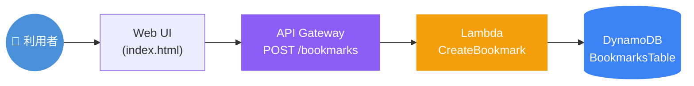
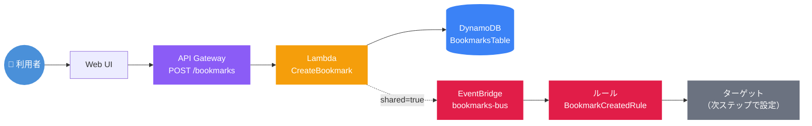
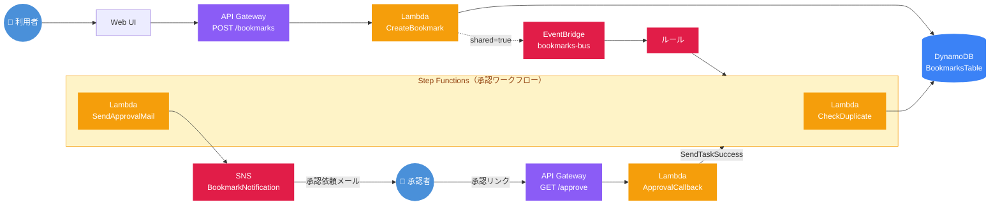

# Bookmark 承認ワークフロー 構成図

## Step 1：タスク1〜4 完了時点（基本の投稿機能）

利用者が Web UI からブックマークを投稿し、API Gateway → Lambda → DynamoDB に保存される最小構成。

---

## Step 2：タスク5 完了時点（EventBridge 連携）

投稿時に `shared=true` の場合、Lambda が EventBridge にイベントを送信。ルールでイベントを検知する仕組みが追加される。

---

## Step 3：タスク6 完了時点（全体構成）

Step Functions による承認ワークフローが完成。重複チェック → 承認メール送信 → 人手承認のフルフローが動作する。

